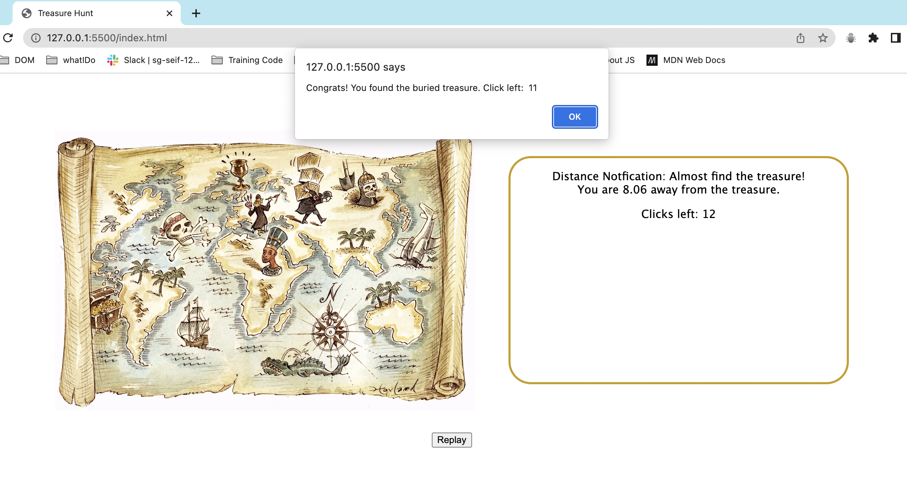

# Project Title Treasure Hunt

The aim of this game is to find the hidden treasure.

## Game Description

In this game, the webpage will display a treasure map and notication box. Inside that map,
the program will pick a single pixel location, which represents where the hidden treasure is
buried treasure. The notification box shows the distance difference between
player's current click location and the treasure location. It shows the remaining clicks left for
the player in the game too. There is a replay button that allows player to reset the game.

### Gameplay

Every time the player clicks the map, the webpage will tell them how close to the
treasure they are. They will be notified by numbers of click left for them.
When they click the location of the treasure (or very close to it), the game congratulates them
on finding the treasure and says how many clicks left remaining.

#### Gameplay Screenshot of Treasure Hunt

##### Reference List

BOOK TITLE: JAVASCRIPT FOR KIDS
AUTHOR: NICK MORGAN
PUBLISHED YEAR: 2015

Gameplay Snap Shot of Treasure Hunt
